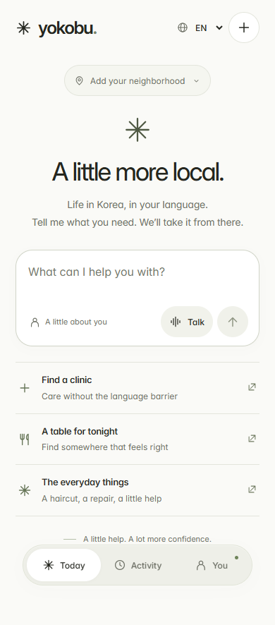

# Mobile interface handoff

Current design branch: `feat/ui-polish`, based on `feat/mobile-concierge`.

This branch preserves the mobile concierge design and the supporting API code. It does not merge into `develop`.

## Try it

```sh
git fetch origin
git switch --track origin/feat/ui-polish
npm ci
npm start
```

Open http://localhost:4173. The interface can be explored without credentials. Chat, search and voice require an OpenAI key under **You → Connection**, or a local `.env` based on `.env.example`. Keys must not be committed. Phone calling additionally requires SIP configuration and OpenAI outbound access; see the main README.

## Design direction

- Warm white and muted olive surfaces, locally bundled Inter, readable secondary text, generous spacing, and subtle borders.
- Shared color, radius, layout and motion tokens in the stylesheet keep the home, conversation, activity and sheets consistent.
- One conversation instead of a multi-step intake form.
- Optional profile context, concise clarification questions, inline results and next steps.
- English, Russian and Korean interface; full-width mobile sheets, keyboard-aware composer positioning, and reduced-motion support.
- Accessible settings tabs, visible keyboard focus, named dialogs, and large mobile touch targets.
- Incoming replies respect a user's reading position; a latest-message control returns to the conversation end. Activity summaries link back to their message.
- Clear separation between proposed actions and confirmed outcomes.



[Desktop preview](../artifacts/ui-polish/desktop-home.png) · [Conversation](../artifacts/ui-polish/mobile-conversation.png) · [Profile sheet](../artifacts/ui-polish/mobile-profile.png)

## Where to work

- `public/index.html`: screens, composer, settings and review sheets.
- `public/styles.css`: typography, spacing, responsive layout and transitions.
- `public/app.js`: conversation rendering, navigation, profile, voice and call UI.
- `public/i18n.js`: interface translations.
- `public/fonts/`: bundled Inter and its license.
- `scripts/ui-polish-check.mjs`: synthetic responsive and interaction QA; run with `npm run test:ui` while the local server is running.
- `server/` and `server.mjs`: API integrations and local session state.
- `public/demo/`: preserved original scripted demo.

For parallel work, create your own branch from this branch, for example `git switch -c feat/your-feature`. Coordinate before editing the same files and integrate through reviewed pull requests. The design branch is a runnable reference, not a verified production deployment.

Validation at handoff: 29 automated tests, 12 integration browser checks, and 19 UI checks passed. The UI report is in `artifacts/ui-polish/results.json`. The frontend build passed. Screens from 320px to 1440px were reviewed, including short viewports and all three languages. Browser AI/voice responses were controlled fixtures; live API, hardware audio, physical mobile keyboards and phone calling were not verified. Historical submission slides still describe the original demo.
