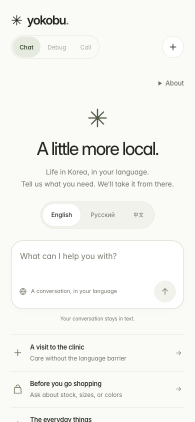

# V2 design integration

Branch: `feat/v2-design-integration`, based on `main` at `62f9a09`, including the latest voice-startup guards and shop-stock rehearsal.

This ports the visual system from `feat/ui-polish` into the existing v2 application. `npm start` still runs `server-v2.mjs`. Customer room creation, versioned polling, server-side credentials, authorization, business acceptance, Korean voice, text relay, and evidence-based completion keep their existing implementation.

## Review and run

```sh
git fetch origin
git switch --track origin/feat/v2-design-integration
npm start
```

Open http://localhost:4173. The separate local integration preview may use port 4174 while an earlier server is running. A new checkout needs its own local `.env` or `OPENAI_API_KEY` environment variable; in-memory keys from another server are not transferred. Use the existing v2 configuration instructions in the README.

Review this branch against `main`. The original `feat/mobile-concierge` and `feat/ui-polish` branches are visual references; their separate concierge backend is not part of this integration.

## Design and interaction

- Shared palette, Inter typography, borders, spacing, rounded controls and reduced-motion support across customer and business screens.
- A clear home composer, language selection, and three editable starting requests. Language stays fixed for the current room, as required by v2.
- Structured call plans, institution choices, relay questions, results and supplied context.
- A measured floating composer that reserves space beneath conversation content, with visual-viewport handling for smaller screens.
- New replies appear at a readable position. Updates preserve the position of someone reading older messages; “Latest update” returns to the end.
- Named confirmation dialogs, keyboard focus handling and mobile touch targets.
- Business call controls, question tracking and transcript arranged for both a laptop operator and a narrow screen.

Relevant files: `public/v2/theme.css`, `styles.css`, `index.html`, `customer.js`, `i18n.js`, `business.css`, `business.html`, and `public/fonts/`. The backend and `public/v2/business.js` are unchanged.

## Validation

```sh
npm test
npm run build
npm run test:http
npm run test:customer
npm run test:business
npm run test:ui
```

Browser checks require an existing Playwright installation. On Windows, `CHROME_EXECUTABLE` can point to `C:\Program Files\Google\Chrome\Application\chrome.exe`. Set `V2_ARTIFACT_DIR=artifacts/v2-design/functional` for HTTP/customer/business checks to keep their new reports separate from previous evidence.

The design suite covers English, Russian and Chinese, 320–1440px layouts, short viewports, the full synthetic customer flow, clinic/shop starters, authorization gates, polling, reading position, keyboard focus, and both screens. It blocks external requests and microphone access. The HTTP suite supplies a dummy key and synthetic plan responses to its child server; it blocks all real upstream requests, making it independent of real credentials.

Reports and screenshots are in `artifacts/v2-design/`. Mocked checks do not establish actual microphone audio or completion with the current OpenAI models. Continue the live rehearsal described in `docs/v2-handoff.md`; physical phone keyboard behavior also needs a device check.

Original integration checkpoint before review repairs: 63 unit tests, 23 local HTTP checks, 20 customer browser checks, 14 business browser checks, and 32 design checks passed (152 total). The frontend build passed. The backend and business voice runtime were verified unchanged against the functional base at `62f9a09`.



[Business desk](../artifacts/v2-design/business-pending-1440.png) · [Call plan](../artifacts/v2-design/en-plan-390.png) · [Relay](../artifacts/v2-design/en-relay-390.png)

## PR review follow-up

The backend and voice runtime were subsequently repaired on this same branch after actual microphone rehearsals. See [v2-pr1-review.md](v2-pr1-review.md) for the preserved failures, fixes, and latest evidence. The original counts above describe `a071f50`, not the final reviewed branch.
